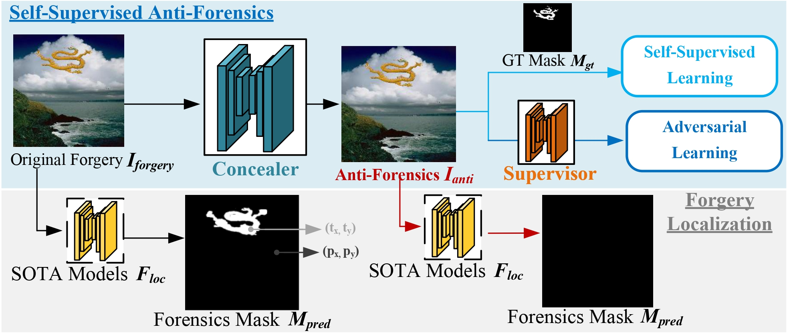

# Evading Detection Actively: Toward Anti-Forensics against Forgery Localization

This is the implementation of the paper "Evading Detection Actively: Toward Anti-Forensics against Forgery Localization"




<br>
<br>

>**Abstract:** *Anti-forensics seeks to eliminate or conceal traces of tampering artifacts. Typically, anti-forensic methods are designed to deceive binary detectors and persuade them to misjudge the authenticity of an image. However, to the best of our knowledge, no attempts have been made to deceive forgery detectors at the pixel level and mis-locate forged regions. Traditional adversarial attack methods cannot be directly used against forgery localization due to the following defects: 1) they tend to just naively induce the target forensic models to flip their pixel-level pristine or forged decisions; 2) their anti-forensics performance tends to be severely degraded when faced with the unseen forensic models; 3) they lose validity once the target forensic models are retrained with the anti-forensics images generated by them. To tackle the three defects, we propose **SEAR** (Self-supErvised Anti-foRensics), a novel self-supervised and adversarial training algorithm that effectively trains deep-learning anti-forensic models against forgery localization. SEAR sets a pretext task to reconstruct perturbation for self-supervised learning. In adversarial training, SEAR employs a forgery localization model as a supervisor to explore tampering features and constructs a deep-learning concealer to erase corresponding traces. We have conducted large-scale experiments across diverse datasets. The experimental results demonstrate that, through the combination of self-supervised learning and adversarial learning, SEAR successfully deceives the state-of-the-art forgery localization methods, as well as tackle the three defects regarding traditional adversarial attack methods mentioned above.*

## Dependency

```
Python, Tensorflow, Keras, openCV, matplotlib, Pillow, numpy, scikit-image, ...
```

## Test

### Attack 

To Attack a forensic model: run the script in ` eval/attack*.sh` (* denotes different forensic model). Like this from ` eval/attack_locate.sh`:

```python
python attack_detector.py \
    --database=nist \
    --detector=locatenet \
    --attack=gan_limit \
    --target=0 \
    --input_size=512 \
    --minclip=-1 \
    --maxclip=1 \
    --save_img=1 \
    --detector_weight=pretrained_weights/locatnet.h5 \
    --generator_weight=pretrained_weights/NIST_pretrain.h5 \
    --save_path=./save_path/ \
    --gpu_id=3
```

Some key conditions:

`database`: use the specific dataset.

`detector`: the name of forensic model.

`attack`: the specific attack method.

`detector_weight`: the path to load the pretrained weights of the detector.

`generator_weight`: the path to load the pretrained weights of the attacker.

`save_path`: the path to save the results.

### Eval
Use `eval/eval_locate_fgsm.sh` and input the path of original images, anti-forensic images and ground-truth images to evaluate the performance of the attack method.


## Train

We provide the training scripts in `train_script` to train a forensic model (ManTran-Net, SPAN and SATFL) and our SEAR. The specific training hyper-parameters are provided in the script as well.


## Citation
If you find this useful for your research, please cite the following paper.
```bibtex
@article{SEAR,
  title={Evading Detection Actively: Toward Anti-Forensics Against Forgery Localization},
  author={Zhuo, Long and Luo, Shenghai and Tan, Shunquan and Chen, Han and Li, Bin and Huang, Jiwu},
  journal={IEEE Transactions on Dependable and Secure Computing},
  volume={22},
  number={2},
  pages={852--869},
  year={2025},
  publisher={IEEE}
}
```
